# Invogen

INTRODUCTION

The Invogen mobile app project is an instant invoice generator system that includes both a mobile and web app, both of which are developed in Flutter. The mobile app is designed to provide a streamlined and intuitive experience for users, enabling them to create and send invoices from their mobile device. The web app offers similar functionality, with the added benefit of being accessible from any device with internet access. Both versions of the app are designed to be user-friendly, with intuitive interfaces and powerful features. Users can customise their invoices with branding, add line items and taxes, and track payments. The Invogen mobile and web app offers a simple and effective solution for businesses and individuals looking to streamline their invoicing process.

SYSTEM FEATURES

1. Signup
2. Login
3. Manage Items
4. Generate Invoice
5. View Invoices History

APPLICAION SCREENSHOTS

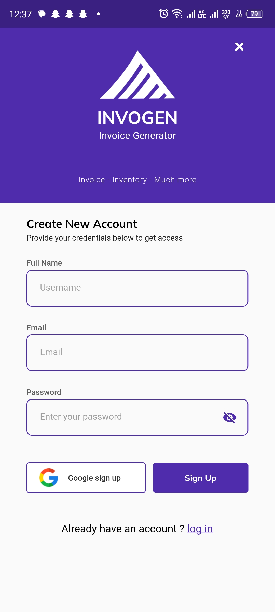 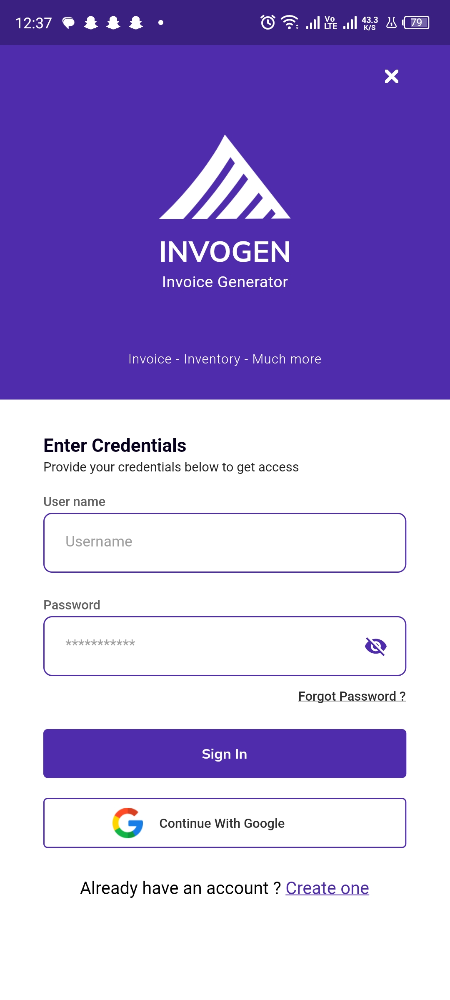 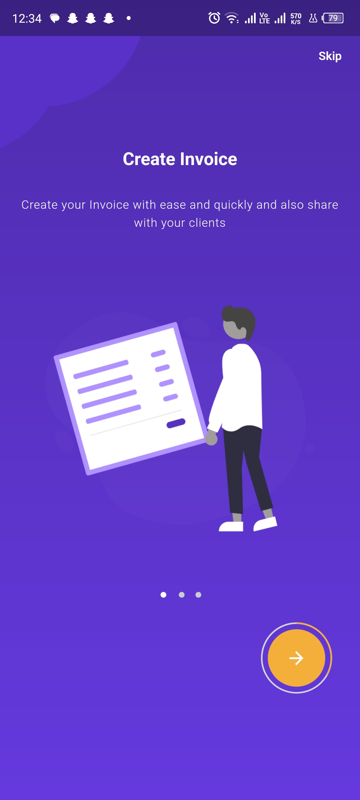 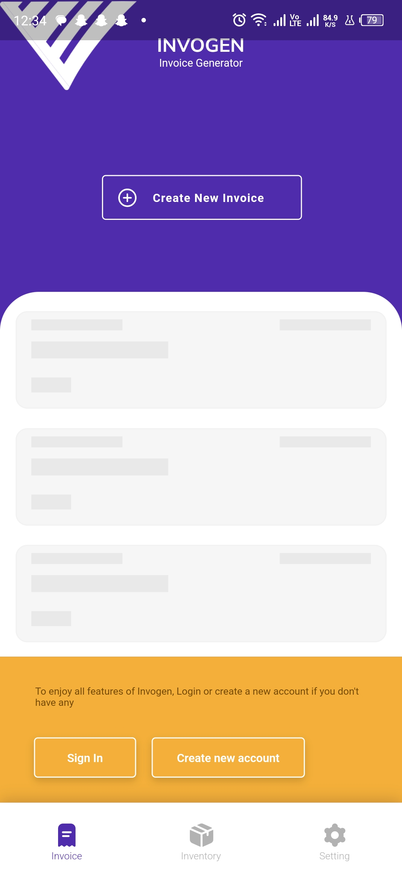 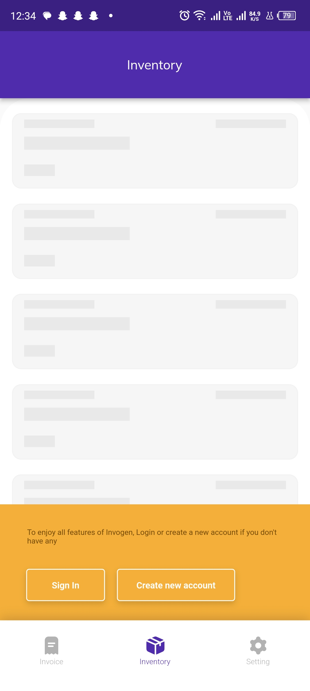 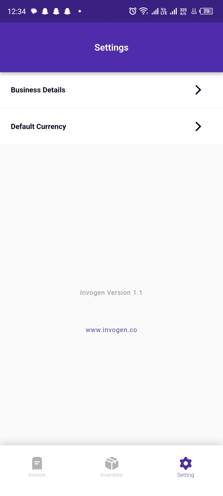 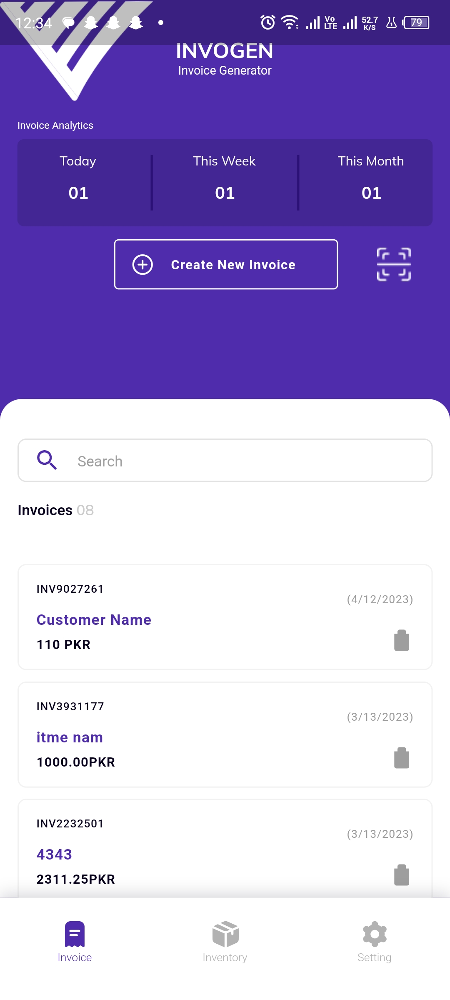 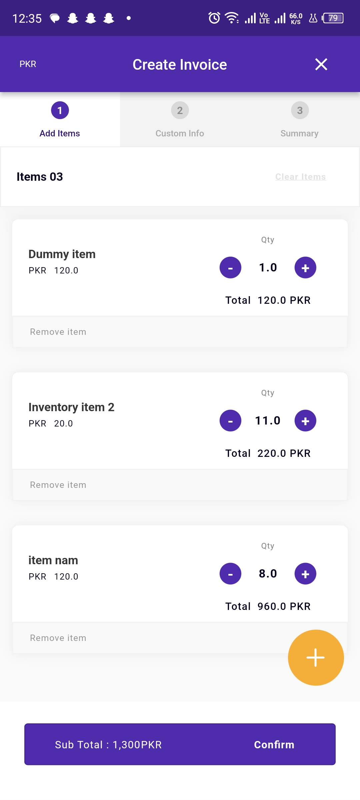 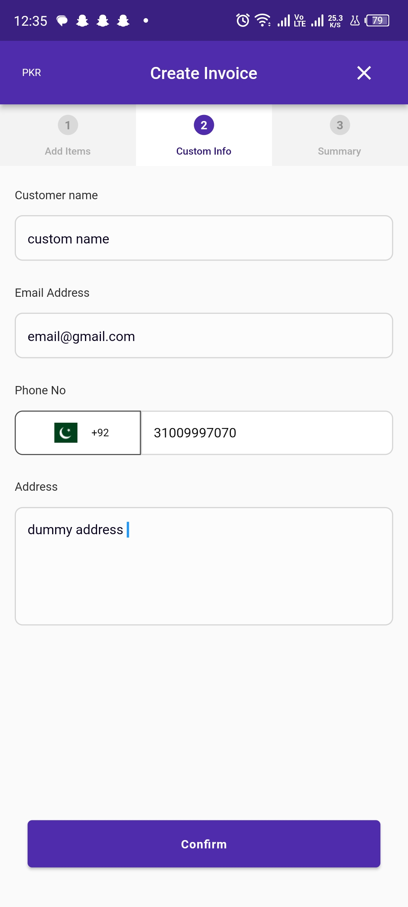 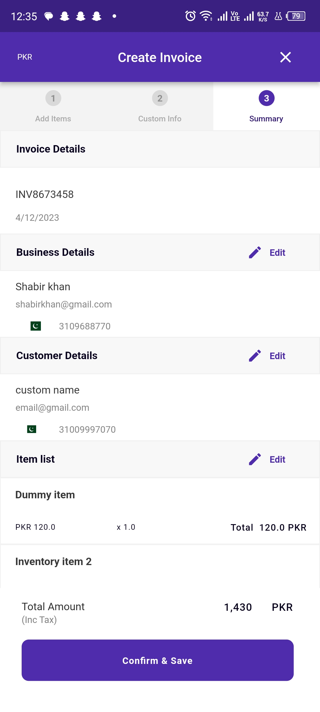 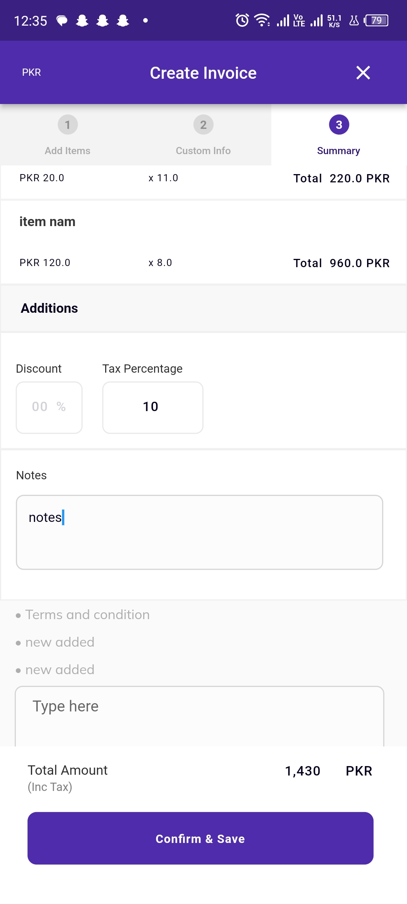 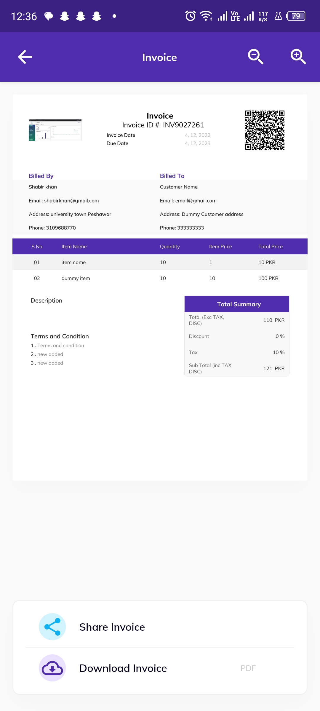 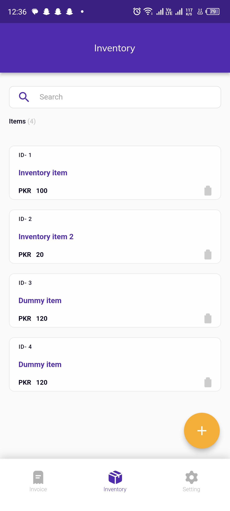 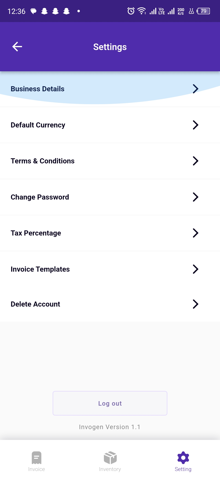 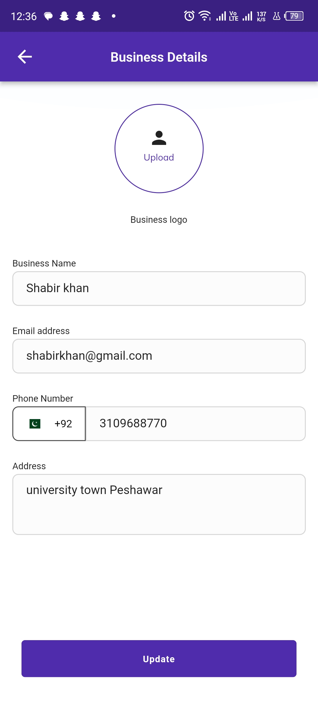 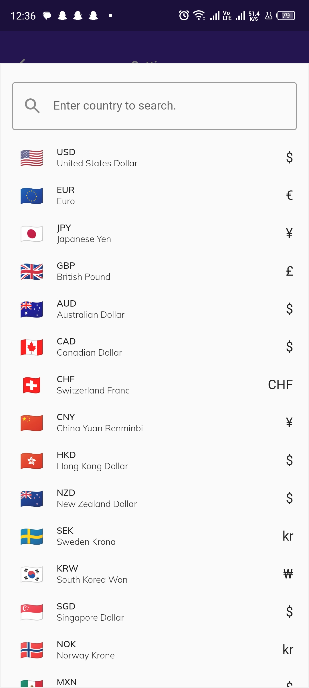 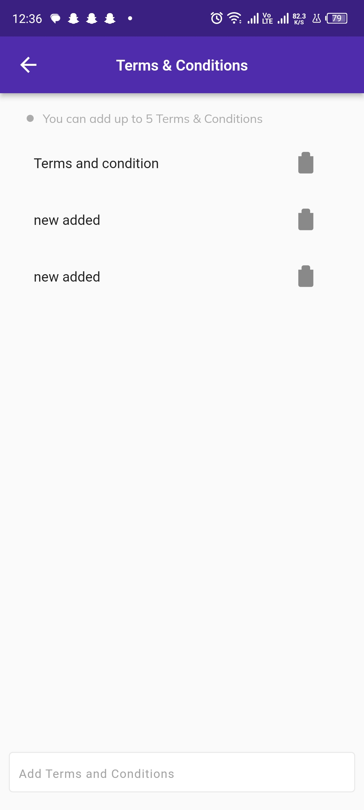 

INSTALLATION LINK

Open Link and proceed with the steps

APK LINK: https://drive.google.com/file/d/1qrvb5MHc27zgXWlHROOT8m4F8db5QLAY/view?usp=sharing
